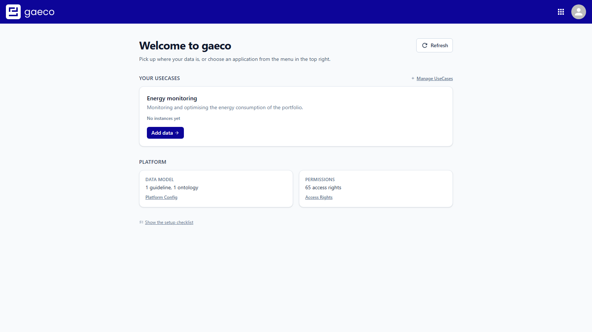
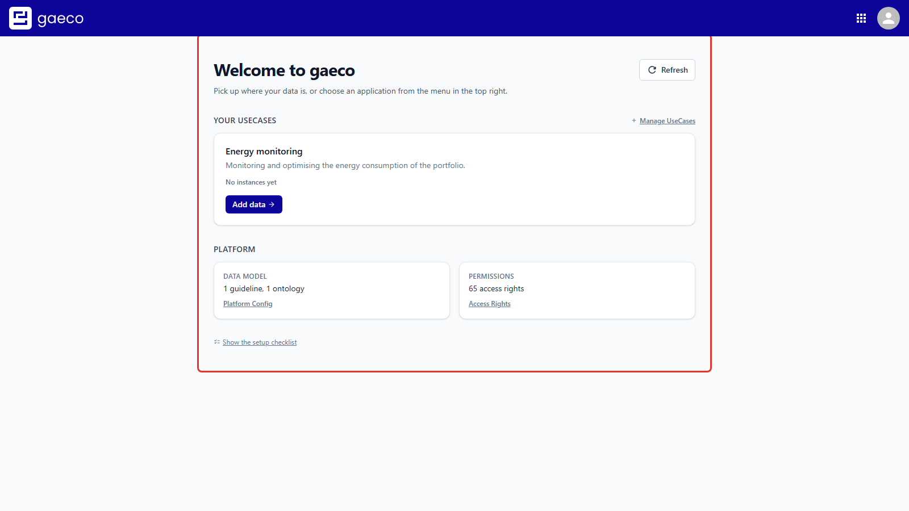
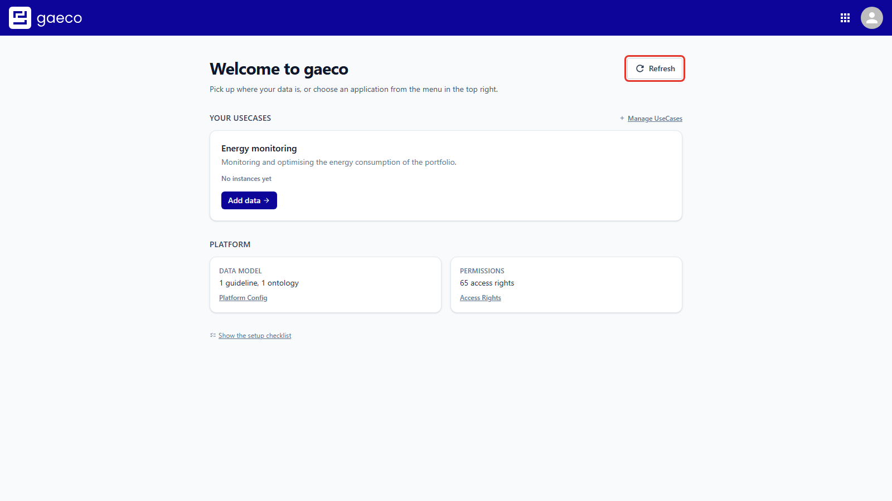
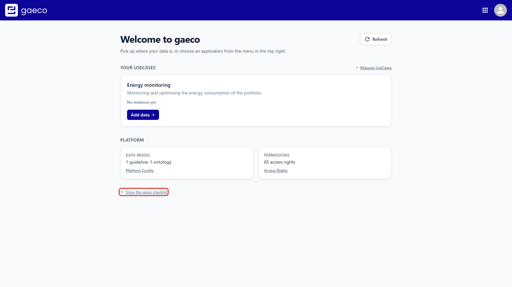

# Introduction

This document describes the Homepage module: the page the Plugin Host shows on `/`, and the
first thing anyone sees after signing in to gaeco.

Its job is narrow and worth stating plainly. It does not manage any data of its own. It asks
the other services what state the platform is in, and tells you what still needs doing before
the platform can take data.

# Prerequisites

- The `PluginHost Service` and `PluginHost Client` must be running.
- The `homepage-client` container must be running, or the client must be started in local
  development mode. The `AppOrchestrator` discovers it from the container labels and binds it
  into the Plugin Host.
- The services the checklist reads from should be running: `Guideline Service`,
  `Ontology Service`, `UseCase Service` and `Access Service`. A service that is unreachable is
  reported as such rather than as "not done".

# The Start Page

After signing in you land here.



The page has two parts: the setup checklist, and a note on loading demo data.

# The Setup Checklist

An empty gaeco installation cannot store anything yet. Three things have to exist first, and
they build on each other — each step depends on the one above it.



| Step | What it is | Where it is done |
| --- | --- | --- |
| 1. Define your data model | A guideline (which classifications exist and what properties they carry) and an ontology (which relationships are allowed) | [Platform Config](https://github.com/gaeco-ekkodale/PlatformConfig) |
| 2. Create a UseCase | The working context that data is viewed and edited from. Permissions and data both hang off it | [UseCases](https://github.com/gaeco-ekkodale/UseCaseService) |
| 3. Assign permissions | Per UseCase and user group, read and write access down to the single property | [Access Rights](https://github.com/gaeco-ekkodale/AccessService) |

Each row shows what it found — "1 guideline, 1 ontology", "1 UseCase", "41 access rights" — or
states that nothing is there yet. The button on the right opens the module that does that step,
so the page doubles as the navigation for a first-time setup.

The header counts how many of the three are done. Once all three are, the platform is ready
and the Instances module can take data.

## Why the order matters

The dependency is not a convention, it is enforced. Access rights are granted for the
properties a guideline declares, within a UseCase — so neither can be configured before the
guideline is uploaded and a UseCase exists. Starting at step 3 simply offers you nothing to
configure.

# Re-check

The checklist is read on load. It **stores nothing** — there is no saved "setup complete"
flag anywhere.



Use **Re-check** after doing something in another module, or after loading demo data, to
query the services again without reloading the whole shell. This is also why the checklist is
trustworthy after a reset of the platform: it reports what the services actually contain,
not what was once true.

# Hiding the Checklist

Once a platform is set up, the checklist stops being interesting. It can be dismissed, and a
control brings it back when you need it — for instance after a clean start, or when handing
the platform to someone else.



# Loading Demo Data

Below the checklist is a shortcut for trying the platform out: instead of doing the three
steps by hand, a script loads a complete demo portfolio — data model, UseCases, permissions
and a filled graph — in one go.

The script lives in the deployment repository:

```bash
python demodata/setup-demo-data.py
```

Run it from the `gaeco-ext` repository root. It is described in
`gaeco-ext/demodata/setup-demo-data.md`. Afterwards choose **Re-check** here, and the
checklist reflects the loaded data.

> **Note:** the hint shown in the module currently points at `cd _docker && python
> setup-demo-data.py` and at `_docker/setup-demo-data.md`. Those paths are out of date — the
> demo data moved to `gaeco-ext/demodata/`.

# What to Do Next

With all three steps done, the data itself goes into the **Instances** module, which is where
classifications become actual objects and get connected into a graph.

For a walkthrough of the three steps in order, with screenshots of each, see the user guide of the
deployment repository.

# Related Documentation

Every module is released as its own repository, each carrying its documentation under `_docu/`:

- **Instance Service** — creating instances and relationships, the graph and the table view
- **Plugin Host** — the shell this module is loaded into
- **Access Service** — the permissions the checklist's third step configures

The user guide of the deployment repository covers the setup end to end, across all of them.
